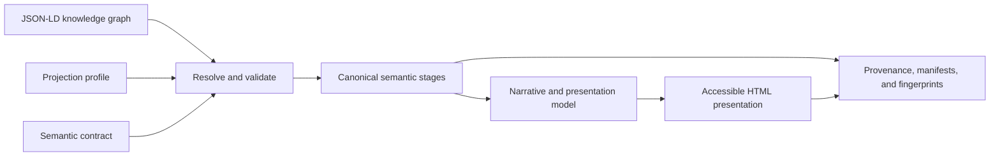

# Relationship Presentation Compiler

> Data exists in graphs. Content is a projection of that data.

The Relationship Presentation Compiler explores a concrete way to fulfil the
vision of the Semantic Web: publish meaning as machine-readable graphs, then
project those graphs into the content people use. Structured knowledge remains
the durable source of meaning while human-facing content is compiled from it as
a deterministic, inspectable projection.

The example is deliberately narrow: a BFO/CCO-aligned relationship graph is
projected into a two-slide HTML presentation. The presentation is not the
source of truth and does not contain a second, independently authored version
of the facts. It is one view of the graph, produced for one audience under one
explicit projection profile.

## The idea

Most web content is authored as the final document. Meaning is embedded in
pages, slides, and prose, so another application must scrape or reinterpret
that content to recover the underlying data.

This POC reverses that relationship:

- knowledge is authored as an RDF graph expressed in JSON-LD;
- a semantic contract defines the graph pattern that is valid for this use;
- a projection profile states how valid graph data should become content;
- the compiler resolves, validates, selects, and traces the required facts;
- the presentation is generated from a target-neutral semantic model;
- manifests and fingerprints make the result independently verifiable.

The graph can therefore remain authoritative while presentations, pages,
reports, or other future views become replaceable projections. Changing a view
does not require changing the underlying facts. Changing a fact produces a new,
traceable projection.



## What the POC understands

The supported graph describes exactly one relationship pattern:

- one `rp:PersonAssociation`;
- one matching CCO Non-Name Identifier;
- exactly two distinct CCO Persons;
- exactly one CCO Designative Name for each Person;
- one supported two-slide explainer profile.

A controlled natural-language request identifies the association to explain.
The compiler expands the JSON-LD with an offline, approved context, resolves
the identifier, validates the closed-world contract, selects six semantic
nodes, constructs a narrative, and projects the result into accessible HTML.

This narrow scope is intentional. The project is testing the architecture of
graph-to-content compilation, not claiming to be a general ontology reasoner,
presentation engine, or natural-language generation system.

## Why compile content from graphs?

Graph-first content projection makes several useful properties possible:

- **Traceability:** source-derived text identifies the graph nodes from which
  its characters were derived.
- **Consistency:** the graph is validated before any presentation is emitted.
- **Determinism:** identical inputs produce identical bytes and fingerprints.
- **Separation of concerns:** facts, semantic constraints, projection intent,
  and visual carriers remain distinct inputs.
- **Portability:** the same edge-canonical core runs under Node.js and in a
  dedicated browser Worker without changing the compilation logic.
- **Auditability:** every intermediate semantic stage is emitted as canonical
  JSON-LD rather than hidden inside a rendering pipeline.
- **Offline operation:** compilation performs no remote context resolution or
  runtime network acquisition.

The larger concept is that a Semantic Web graph should be able to drive useful
human experiences directly. Content becomes a trustworthy interface to the
graph instead of an opaque container from which meaning must later be mined.

## Compilation model

The compiler consumes eight byte inputs:

- the source graph, controlled request, and user projection profile;
- the locked context, semantic contract, canonical profile, stylesheet, and
  navigation payload.

It produces a fourteen-file artifact set containing:

- seven inspectable JSON-LD stages for request, resolution, validation,
  selection, narrative, presentation, and HTML projection;
- the accessible `presentation.html` and a sandboxed diagnostic `demo.html`;
- core and distribution manifests, a validation report, the approved context,
  and an ownership sentinel.

The output manifests bind every canonical byte with SHA-256 fingerprints. A
consumer can verify the projection without trusting the filesystem or host that
created it.

## See the projection

The verified example presentation and its intermediate artifacts are published
on [GitHub Pages](https://skreen5hot.github.io/Relationship-Presentation-Compiler/).
The site is a static view of the compiler output; compilation itself remains
local and offline.

## Run it locally

Use Node.js 24.19.0 and npm 11.17.0, then install the locked dependency graph:

```text
npm ci
```

Compile the canonical example:

```text
node index.js
```

This reads the repository's example graph, request, and profile and publishes
the verified artifact set to `dist`.

Compile explicit inputs:

```text
node index.js \
  --source fixtures/relationship-42.jsonld \
  --request fixtures/relationship-42-request.txt \
  --profile profiles/two-slide-explainer.jsonld \
  --out ../relationship-presentation-output \
  --replace
```

The Node host validates its runtime and locked evidence, enforces input and
output trust boundaries, runs the core in a supervised Worker, publishes through
an OS-locked recoverable staging protocol, and verifies the result after
publication.

## Verify the implementation

Install the pinned Chromium shell once, then run the complete Node and browser
conformance suite:

```text
node node_modules/playwright/cli.js install --only-shell chromium
npm test
```

The suite covers canonical, late-bound, generated, metamorphic, hostile, and
invalid graphs; exact structural boundaries; deterministic failure ordering;
accessibility and navigation; independent-process determinism; and byte-level
equivalence between the Node host and a real browser Worker.

## Scope and design

This repository is a POC for deterministic semantic projection. It does not
provide a hosted compilation service, accept untrusted uploads, perform general
RDF inference, or support arbitrary graph shapes and presentation templates.
Those capabilities would require deliberate contracts of their own rather than
an expansion of this closed proof surface.

The normative architecture and conformance requirements are defined in
[`relationship-presentation-spec-v1_0.md`](relationship-presentation-spec-v1_0.md).
Design decisions and implementation evidence are retained in [`docs/`](docs/)
for readers auditing how the POC establishes its claims.
